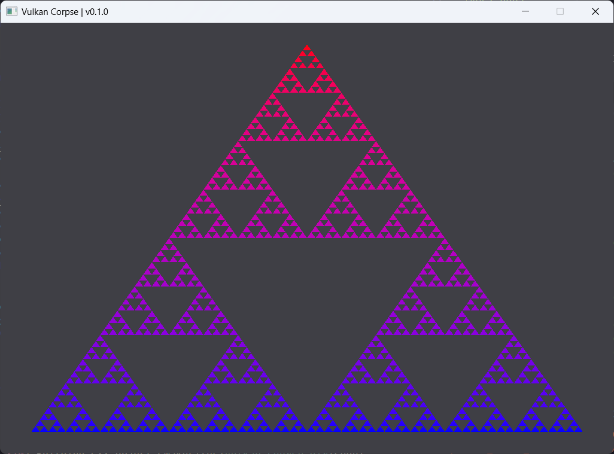

# Vulkan Corpse

## Current progress

	

## What is that?

Didn't you get it reading the title? I just trying to learn Vulkan in the `static_cast<size_t>(-1)` time.

## How to build?

I usually use vscode with the [CMake Tools](cmake-tools-link) extension. The compiler I use is `Clang 18.1.7 x86_64-pc-windows-msvc`, but you should probably success to build with your own.

## What about to run & debug?

It's essentially important to open the [workspace](./vulkan-course.code-workspace) to debug the project using <kbd>F5</kbd> key.

If you want to just run it, the execution directory is root of the project, so the `assets` directory should be near the place you run.

<!-- LINKS -->

[cmake-tools-link]: https://marketplace.visualstudio.com/items?itemName=ms-vscode.cmake-tools
